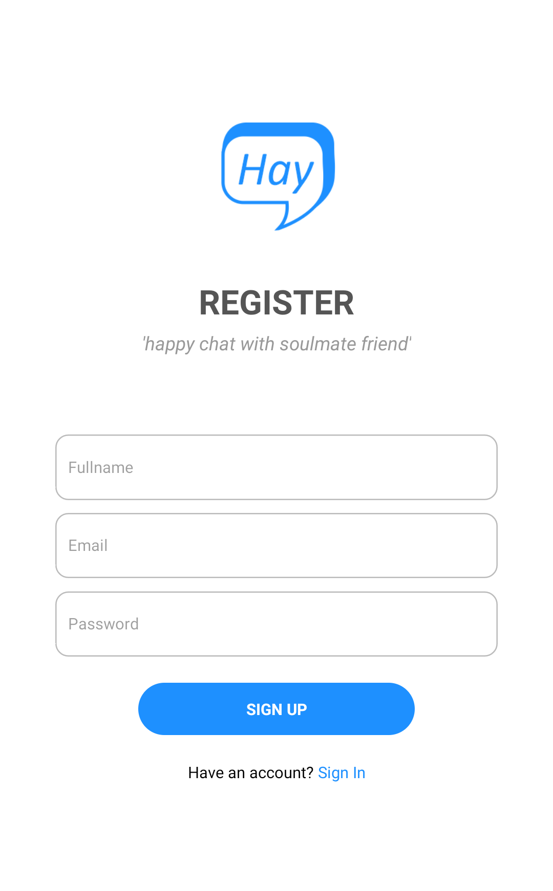
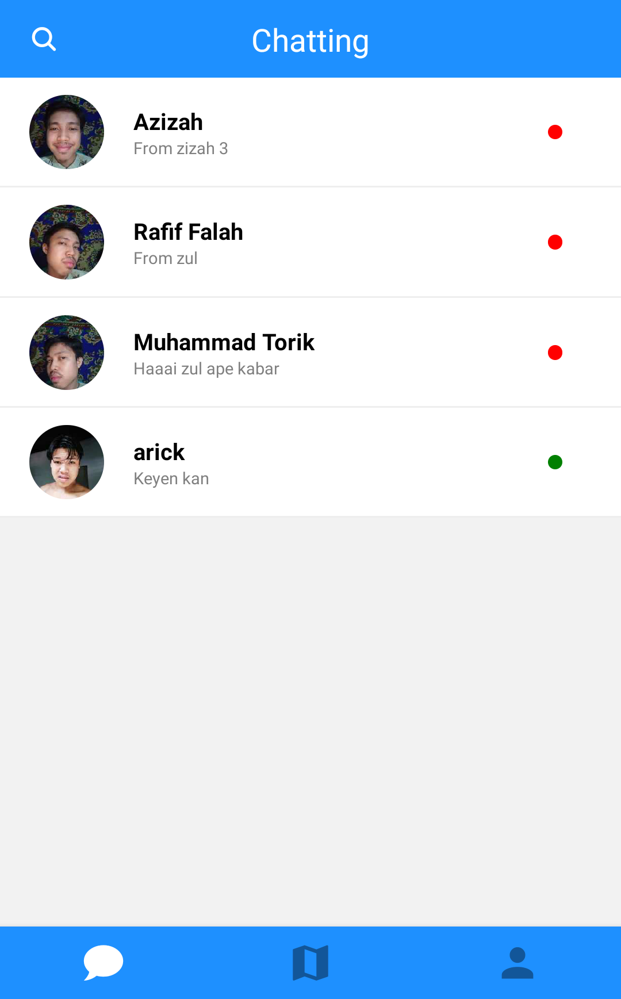
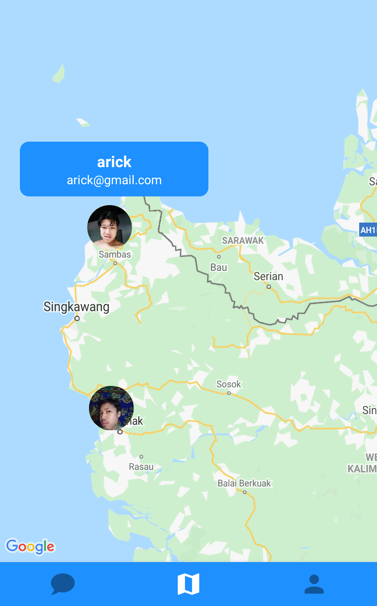
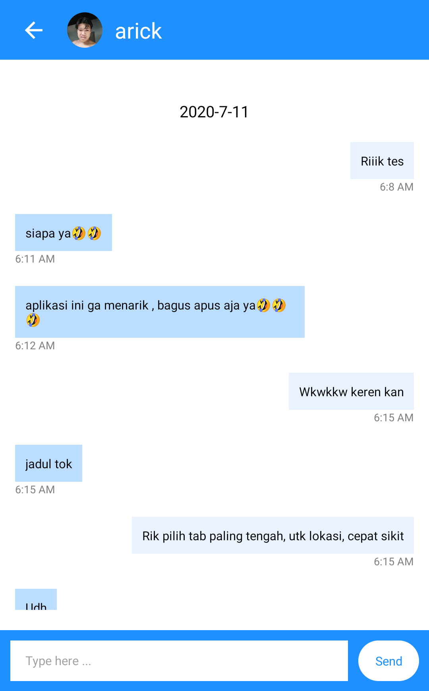
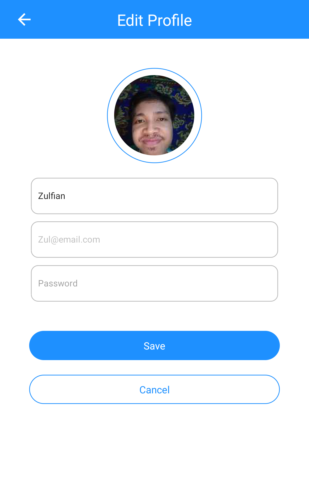

<h1 align="center">Hay</h1>
<p align="center">
  
</p>
<p align="center">
  - by Zulfian -
</p>

## Table of Contents

- [Introduction](#introduction)
- [Features](#features)
- [Requirements](#requirements)
- [Setup Firebase](#setup-firebase)
- [Usage](#usage-for-development)
- [Screenshots](#screenshots)
- [Release APK](#release-apk)
- [Contributor](#contributor)

## Introduction

<b>Hay</b> is a mobile application real time chat with your friend and maps location by user. The technology used is Google Real Time Firebase and React Native.

## Features

- User Login Register
- User Authentication
- User Status online/offline
- Realtime Chat
- Last chat by sender
- Last coordinate maps with maker description user
- Edit profile

## Requirements

- [`npm`](https://www.npmjs.com/get-npm) or [`yarn`](https://yarnpkg.com/getting-started/install)
- [`react-native`](https://facebook.github.io/react-native/docs/getting-started)
- [`Google Maps API Key`](https://developers.google.com/maps/documentation/javascript/get-api-key)

## Setup Firebase

Setup firebase configuration to src/config/Firebase.js,

```
const firebaseConfig = {
  apiKey: "YOUR_apiKey",
  authDomain: "YOUR_authDomain",
  databaseURL: "YOUR_databaseURL",
  projectId: "YOUR_projectId",
  storageBucket: "YOUR_storageBucket",
  messagingSenderId: "YOUR_messagingSenderId",
  appId: "YOUR_appId",
  measurementId: "YOUR_measurementId"
};
```

## Usage for development

1. Open your terminal or command prompt
2. Type `git clone https://github.com/iiizulfiannn/hay-reactnative-firebase`
3. Open the folder and type `npm install or yarn install` for install dependencies
4. [Setup Firebase](#setup-firebase)
5. Add your Google Maps API Key `android/app/src/main/AndroidManifest.xml`

```
<meta-data
  android:name="com.google.android.geo.API_KEY"
  android:value="YOUR_API_KEY"
/>
```

6. On your terminal first time run `yarn start` and continue run `yarn android`
7. Register with your email and password, and login
8. Edit your profile with add image
9. Happy chat with your soulmate :)

## Screenshot App

<div align="center">
    
    
    
</div>

<div align="center">
    
    
    
</div>

## Release APK

<a href="https://drive.google.com/file/d/1I8ZmI1DLKfZCVLMsdKamLQuyoLl6Xas3/view?usp=sharing">
  
</a>

## Contributor

- [Zulfian](https://github.com/iiizulfiannn 'Zulfian')
